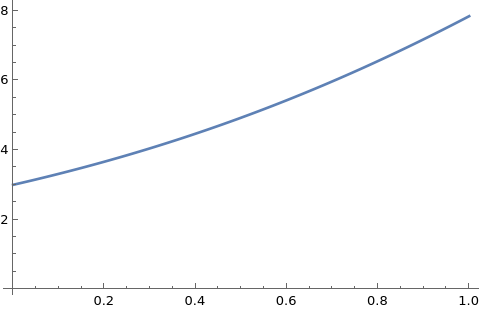

# Euler Method with modification for Solving ODEs

## Problem Statement

Given the first-order ordinary differential equation (ODE):

$$\frac{dy}{dx} = f(x, y)$$

with an initial condition:

$$y(x_0) = y_0,$$

we aim to approximate the solution over the interval $[x_0, x_n]$ using the modified Euler method.

### Approach

The Euler method is a simple numerical technique that provides an iterative solution to the ODE. The main idea is to use the slope at the beginning of an interval to estimate the function's value at the next point.

1. **Discretize the interval:** Divide the interval $[x_0, x_n]$ into $n$ equal subintervals of width $h$, where:
   $$h = \frac{x_n - x_0}{n}.$$

2. **Iteration Formula:** The iterative formula for the Euler method is given by: 
   $$y_{i+1}^* = y_i+hf(x_i, y_i)$$ 
   $$y_{i+1} = y_i + \frac{h}{2} ( f(x_i, y_i) + f(x_{i + 1}, y_{i + 1}^*))$$ 
   where $y_i$ is the approximation of $y(x_i)$, and $x_i = x_0 + ih$.

3. **Initialization:** Start with the initial condition:
   $$y_0 = y(x_0).$$

### Example

Consider the ODE:
$$\frac{dy}{dx} = y - x^3,$$
with the initial condition $y(0) = 3$. We can apply the Euler method to approximate $y$ over the interval $[0, 1]$.

### Conclusion

The Euler method provides a straightforward way to numerically solve ODEs, though its accuracy depends on the step size $h$ and the nature of the function $f(x, y)$.

## Graphs

### modified Euler Method Graph

The graph below shows the approximate solution obtained using the Euler method.

### Wolfram Graph

The graph below represents the exact solution provided by Wolfram Alpha.

## Error Analysis: modified Euler Method vs. Wolfram Results

In this section, we analyze the accuracy of the Euler method by comparing its results with those obtained from Wolfram Alpha. We calculate both the absolute and relative errors to quantify the discrepancies between the two methods.

### Results

- **Absolute Error:** \(0.000144716\)

  The absolute error represents the difference between the actual value obtained from Wolfram and the approximate value calculated using the Euler method. It provides a straightforward measure of the deviation in the results.

- **Relative Error:** \(1.86084e-05\)

  The relative error is defined as the absolute error divided by the true value (Wolfram result). This metric gives us a sense of the error relative to the magnitude of the true value, making it easier to assess the performance of the Euler method in different contexts.

## Error Analysis: simple Euler Method vs. Wolfram Results

### Results

- **Absolute Error:** \(0.0320508\)

  The absolute error represents the difference between the actual value obtained from Wolfram and the approximate value calculated using the Euler method. It provides a straightforward measure of the deviation in the results.

- **Relative Error:** \(0.00408543\)

  The relative error is defined as the absolute error divided by the true value (Wolfram result). This metric gives us a sense of the error relative to the magnitude of the true value, making it easier to assess the performance of the Euler method in different contexts.

## Conclusion

The analysis of these errors indicates that while the Euler method provides a reasonably close approximation to the true solution, but modified Euler method gives much more precise results compared to the analytics ones (Wolfram). 
